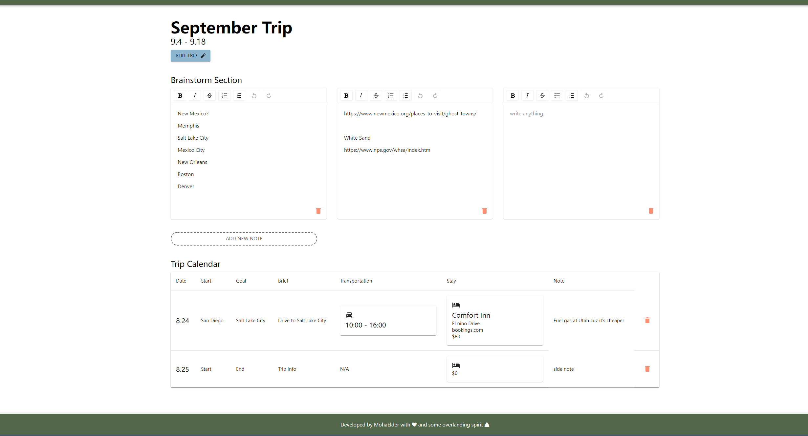

# Let's Plan A Trip


A Trip planner that **actually** does trip planning. 

[Let's Plan A Trip now!](https://lpat.netlify.app/)

*This project is currently my personal project, but I am thinking of expanding it into a team project. Meanwhile, I am always open to any PRs or issues :).*

# Table of contents

- [Brief](#brief)
- [How Does Let's Plan A Trip help with trip planning](#how-does-lets-plan-a-trip-help-with-trip-planning)
- [Features](#features)
- [Roadmap](#roadmap)
- [Running from the source code](#running-from-the-source-code)
- [Contributing](#contributing)
- [Contact Me](#contact-me)

## Brief

"Let's Plan A Trip" is a trip planner that **focuses on planning the trip**. Unlike most other trip planning apps that emphasizes on route planning, providing you a fancy map and charging you for exporting their route into Google Maps, Let's Plan A Trip's goal is to really help you plan a trip by providing you a variety of handy tools that I the author use to plan my trips in a elegant and neat format.

and it's **free**~

## How Does Let's Plan A Trip help with trip planning

Let's Plan A Trip is a **Note Oriented planning app**. When planning a trip, you start with writing stuff on notes(s): places that you want to visit, things that you would like to do, visa concerns, etc. 



Once you get some ideas for your trip, you can start planning by creating **trip segments**. The purpose of trip segment is to better organize your trip plan by splitting portions of them into segments. If you are planning a trip less than a week, you probably just need one segment that has been automatically created for you. But if you are planning some grand trips(like a 1 month road trip to Alaska), you will find splitting the trip into segments really convienient when planning(and when looking at it).


Plus, Let's Plan A Trip has a pretty good Calendar:


Lastly, Let's Plan A Trip does not require login, you just go to the website, and you can click the save button to **save the trip file locally** and edit it next time.

## Features

1. Unlimited Wysiwyg Note(for the dashboard and each trip segments)
2. Trip Segmentation
3. An Itinenary Calendar that **supports the itinenary of each day**, includes information of: Start, End, Brief, Transportation, Stay, side note, and the time specific itinenary of that day
4. Transportation Info that includes transportation type, departure & arrival time, transportation number & station address(both optional)
5. Stay Info that includes confirmation link(optional), name, address, cost, and stay type. It automatically updates the cost to the budget table.
6. A budget table that supports quantity and sum calculation.
7. An overview of the whole trip's calendar from the Dashboard view.
8. An overview of the whole trip's budget from the Dashboard view.

## Roadmap

This section displays the list of ongoing developments on the project. 

🛠️：currently working on it

✅: done

⚠️: has some problems, need help or will work on it after gaining more knowledge

💭: planned 

- Fix Date Bug of going over the pages and the date messes use ✅
- Fix Date Bug of trip date can be edited out of trip segments' bounds ✅
- Map ⚠️(Map is kind of awkward right now, I'm not sure how it should appear in the trip planner, will come back and update once I have a better idea)
- Checklist 🛠️
- Fix time picker cannot input 2 digit minutes 🛠️
- Fix note section's placeholder does not disappear when list is enabled 💭
- Change the segment picker to scrollable NavBar ✅

## Specifications

The project is currently pure front end, built with React + TypeScript + Redux.

List of used libraries:

- [react-draft-wysiwyg](https://github.com/jpuri/react-draft-wysiwyg) for the note editor.
- apple map for map(still developing)
- [mui](https://mui.com/) for UI
- [js-file-download](https://github.com/kennethjiang/js-file-download) for file saving
- [react-file-reader-input](https://github.com/ngokevin/react-file-reader-input) for file reading
- [react-to-print](https://github.com/gregnb/react-to-print) for printing the trip

## Running from the source code

```bash
git clone https://github.com/MohaElder/Trip.git

cd Trip

npm install

# or

yarn

#pick one of them👆

npm start

#the project should be running at http://localhost:3000

```

## Deploying the project

```bash

npm run build

```

## Contributing
I am open to any PRs!

## Contact Me

If you have any issues with the trip planner, feel free to raise an issue on Github or file a PR. If you wish to join me on this project in a more consistent manner, feel free to contact me at calen0909@hotmail.com. 
